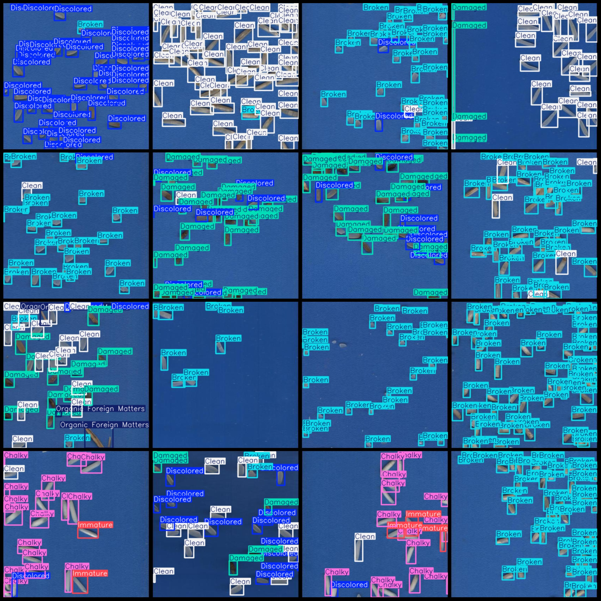
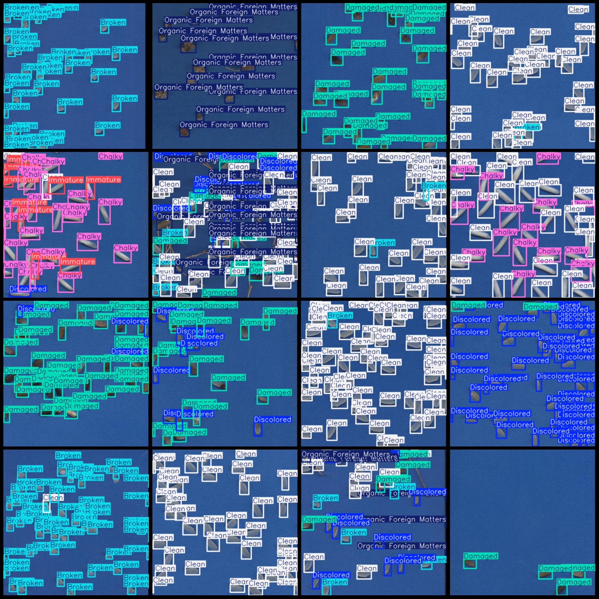

# Rice Grain Quality Detection Dataset VOC+YOLO format with 4832 images in 7 categories

Dataset format: Pascal VOC format + YOLO format (Without split path in txtfile, only contain jpgimage and corresponding VOC format xmlfile and yolo format txtfile)
The number of images (number of jpg files): 4832
annotation count: 4832  
annotation count: 4832  
It seems like there might be a typo in your request. If you could provide more context or clarify what you're asking about, I'd be happy to help!
Annotation class names (note that the order of YOLO format class names does not correspond to this, but is based on labelsfile/classes.txt): ["Broken", "Chalky", "Clean", "Damaged", "Discolored", "Immature", "Organic Foreign Matters"]
boxes per class:   
The number of broken frames is 73488.
Chalky (pigmented/buff) box count = 19038
Clean (clean) box count = 115888
The damaged frame count is 25314.
The discolored frame number is 43198.
"Immature" is a noun, not an adjective. It can be used to describe someone who is not yet fully developed or matured. In mathematics and statistics, it is often used to refer to the number of incomplete calculations or unfinished tasks.
Organic Foreign Matters (OFM) box count is the number of items in a shipping container that are not considered part of the goods. This includes items such as plastic bags, boxes, and other packaging materials. The OFM count is an important metric for determining the cost of freight and insurance for importing and exporting goods.
The total number of frames is 305976.
Number of images per category:
The number 2148 is a prime number.
Chalky (Pellow) occupies 606 pictures.
Clean images = 2947
The number of damaged images is 1303.
It seems like you have a question about the word "Discolored" and its usage in relation to pictures. However, the information provided does not seem to directly relate to this context. If you could provide more details or clarify your question, I would be happy to help!
Immature images = 896  
Organic foreign materials (organic foreign substances) images = 801
image resolution: 416x416  
Use annotation tool: labelImg
Annotation rule: draw a rectangle around the class.
Important Note: The dataset does not have a division into training, validation, and testing sets.
Special Statement: This dataset does not guarantee the accuracy of the trained model or weight file.
Image Preview:
## Images

Here is a pay link on Stripe ( https://buy.stripe.com/3cs8yP7sY87d0vu9AB ). Please contact me lonlonago@foxmail.com after funding $89, and I will send you a complete data files , thank you!

